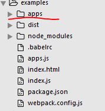
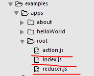

# xr-app-loader

- 这是一个基于react, redux, immutable的开源项目
- 简化原生redux实现状态管理的过程
- 以app的方式隔离状态和代码
- 单页程序，通过提供不同app path装载不同应用
- 每个app模式统一，维护性，大规模开发，项目管理更加容易


## 运行example

```
$ cd examples
$ npm install
$ npm start
浏览器访问127.0.0.1:8089

```

## 开始使用

### 1、项目主index.js增加代码

如下程序
```javascript
import React from 'react'
import { render } from 'react-dom'
import { createStore, applyMiddleware } from 'redux'
import { Provider, connect } from 'react-redux'
import { createLogger } from 'redux-logger'
import { Map } from 'immutable' //state数据结构采用immutable Map
import { AppLoader, appMiddleware, reducer } from 'xp-app-loader' //主要提供了AppLoader,appMiddleware
import apps from './apps' //需要一个apps.js描述所有应用配置

//通过appMiddleware创建一个redux中间件
const middleware = [appMiddleware(apps), createLogger({})]

//创建redux仓库,根reducer使用项目提供的reducer
const store = createStore(reducer, Map(), applyMiddleware(...middleware))

//使用AppLoader加载某个应用
render(
	<Provider store ={store}>
		<AppLoader path='apps/root' />
	</Provider>,
	document.getElementById('app')
)

```

### 2、创建应用

- 创建apps目录



- 在apps目录下增加具体应用目录


- app下增加文件

index.js //纯组件,主要处理界面

action.js //纯函数action，主要处理界面发起的行为，包括对外部ajax调用

reducer.js //纯函数reducer，主要处理状态，action会调用reducer某个方法更新状态

style.less //应用样式，示例中没写，如果需要自行添加，然后再index.js中import



- 创建apps.js文件


