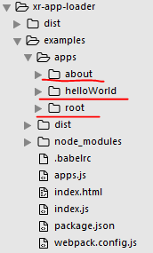
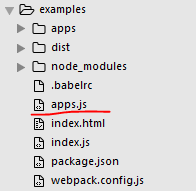

# xr-app-loader

- 这是一个基于react, redux, immutable的开源项目
- 简化原生redux实现状态管理的过程
- 以app的方式隔离状态和代码
- 单页程序，通过提供不同app path装载不同应用
- 每个app模式统一，维护性，大规模开发，项目管理更加容易


## 运行example

```
$ cd examples
$ npm install
$ npm start
浏览器访问127.0.0.1:8089

```

## 开始使用

### 1、项目主index.js增加代码

如下程序
```javascript
import React from 'react'
import { render } from 'react-dom'
import { createStore, applyMiddleware } from 'redux'
import { Provider, connect } from 'react-redux'
import { createLogger } from 'redux-logger'
import { Map } from 'immutable' //state数据结构采用immutable Map
import { AppLoader, appMiddleware, reducer } from 'xp-app-loader' //主要提供了AppLoader,appMiddleware
import apps from './apps' //需要一个apps.js描述所有应用配置

//通过appMiddleware创建一个redux中间件
const middleware = [appMiddleware(apps), createLogger({})]

//创建redux仓库,根reducer使用项目提供的reducer
const store = createStore(reducer, Map(), applyMiddleware(...middleware))

//使用AppLoader加载某个应用
render(
	<Provider store ={store}>
		<AppLoader path='apps/root' />
	</Provider>,
	document.getElementById('app')
)

```

- AppLoader组件属性

属性 | 说明 | 类型
-----|-----|-----
path | app包路径 | string

- appMiddleware redux中间件函数入参

参数 | 说明 | 类型 | 可空
-----|-----|-----|-----
1参数 | app获取方法 | function | 否
2参数 | action注入对象 | object |是
3参数 | reducer注入对象 | object |是


### 2、创建应用

- 创建apps目录


- 在apps目录下增加具体应用目录



- app下增加文件

index.js //纯组件,主要处理界面

action.js //纯函数action，主要处理界面发起的行为，包括对外部ajax调用

reducer.js //纯函数reducer，主要处理状态，action会调用reducer某个方法更新状态

style.less //应用样式，示例中没写，如果需要自行添加，然后再index.js中import


### 3、创建apps.js文件

这个文件主要作用是AppLoader加载某个path应用的时候，根据这个path确定component,action,reducer



内容示例：

```javascript
export default function requireApp(path, cb) {
    
    if(path === 'apps/root'){
        cb( require('./apps/root/index'),
            require('./apps/root/action'),
            require('./apps/root/reducer'))
    }

    else if(path === 'apps/about'){
        cb( require('./apps/about/index')) //可以没有action,reducer,说明该应用很简单不需要管理状态
    }
}

```


### 4、增加app index.js代码

index一个标准的react组件，示例代码如下

```javascript
import React,{Component} from 'react'

export default class HelloWorldComponent extends Component{

    componentDidMount() {
    	//组件加载完毕调用action的initView方法，可以没有
        this.props.initView()
    }

	render(){
		//this.props中包含所以action export的方法,以及payload当前这个app的state等
		if(this.props.payload)
			return (<div>{this.props.payload.get('text')}</div>)
		else
			return null
	}
}
```

- this.props包含属性介绍


属性 | 说明 | 数据类型
-----|-----|-----
action文件中export的所有方法 | component可以通过this.props.action方法名(),调用action文件中export的所有方法 | function
payload | 当前应用的状态 | immutable Map
appSource | 当前app path，如：apps/helloworld?a=1 | string
appPath | 当前app path,不包括'?'后字符串，如：apps/helloworld | string
appQuery | 当前app path中'?'后字符串，如：a=1 | string
appParams | appQuery转object,如：{a:1} | object

### 5、增加action代码

action纯函数化，定义component事件需要处理的一些行为方法，示例代码如下

```javascript
export function initView(){
	//injectFuns是appMiddleware注入对象，其中最重要的一个reduce方法可以指定reducer方法名就可以调用
	//避免redux中处理消息的很多代码
	return injectFuns=>{
		injectFuns.reduce('initView')
	}
}
```

- injectFuns是appMiddleware注入的，默认包含下面两个方法，也可以在new appMiddleware的时候自己增加

属性 | 说明 | 数据类型
-----|-----|-----
reduce | reduce方法能调用reducer的方法，格式：reduce(reducer中方法名, 参数1, 参数2...)|function
getState | getState方法能取到当前应用的state | function 


### 6、增加reducer代码

reducer纯函数化，定义修改状态的方法，由action调用

它里面所有对外的方法第一个参数是state表示旧状态，返回值是新状态

示例代码如下

```javascript
import {Map} from 'immutable'

export function initView(state=Map() ){
	return state.set('text', '这是hello world app!')
}
```


